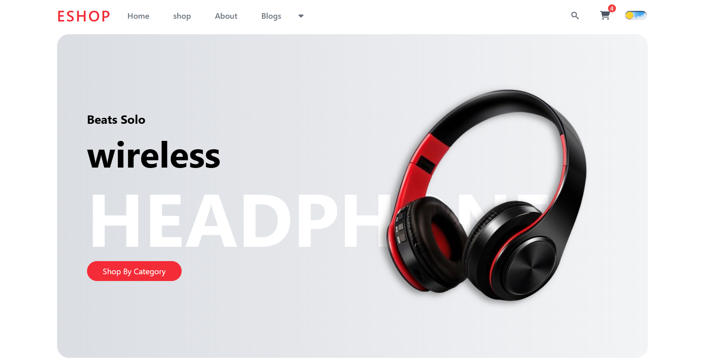
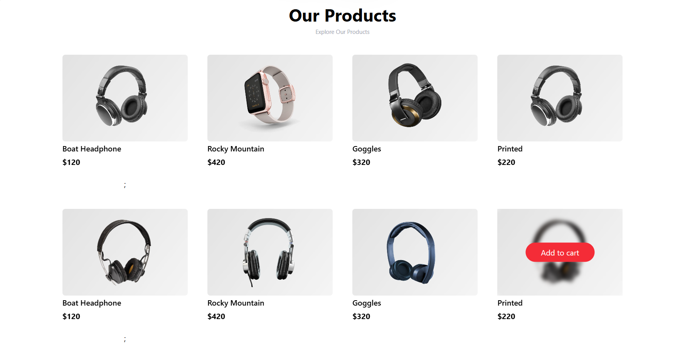
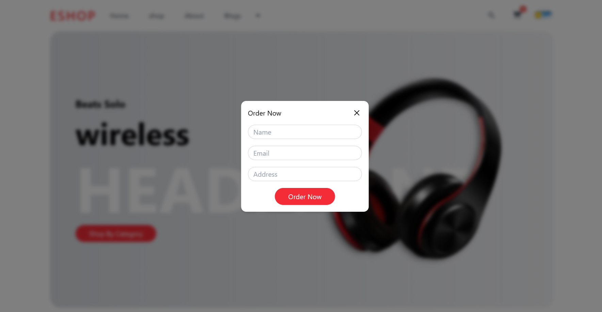

# 🛍 Gautam’s E-Commerce Website

  
  
  


---

## 👨‍💻 Author

*Name:* Gautam Sagar  
*Email:* gateaspirant8650@gmail.com  
*Phone:* +91 7900503595  
*GitHub:* [codergautam900](https://github.com/codergautam900)

### 📊 GitHub Profile Stats  
  
  
  

---

## 🚀 Tech Stack

- ⚛ *Frontend:* React.js (with Vite)  
- 🎨 *Styling:* Tailwind CSS / Custom CSS  
- 🔄 *State Management:* React Context API (or local state)  
- 🌐 *Routing:* React Router DOM  
- ☁ *Deployment:* Netlify  

---

## ✨ Features

- 📱 Responsive Design across devices  
- 🖼 Home Page with hero banners, categories & sale sections  
- 🛒 Shop Page with product listing & prices  
- 📰 Blog/News Section  
- 📝 Popup Order Form (modal with Name, Email, Address)  
- 🔗 Footer with quick links, contact and socials  
- ⚡ Fast optimized builds via Vite  

---

## 🌐 Live Demo

🔗 [Visit Website](https://gautam-ecommerce-website.netlify.app/)  

---

## 📸 Screenshots

### 🏠 Home Page  


### 🛍 Products Section  


### 📰 Blogs/News Section  


### 📝 Order Form Modal  


*(Place screenshots in a screenshots/ folder with above filenames)*  

---

## 📂 Project Structure
├── public/
├── src/ │   ├── assets/
│   ├── components/
│   ├── pages/
│   ├── context/
│   ├── styles/
│   ├── App.jsx
│   └── main.jsx
├── package.json ├── vite.config.js └── README.md

---

## ⚙ Getting Started

### Clone the repository
```bash
git clone https://github.com/codergautam900/react-vite-ecommerce.git
cd react-vite-ecommerce

Install dependencies

npm install
# or
yarn install

Run Development Server

npm run dev

👉 Runs at: http://localhost:5173

Build for Production

npm run build


---

🌍 Deployment on Netlify

1. Push project to GitHub


2. On Netlify, click New Site from Git


3. Connect your repo: codergautam900/react-vite-ecommerce


4. Set:

Build command: npm run build

Publish directory: dist


5. Deploy 🚀


---

📜 License

Licensed under the MIT License


---

🙏 Acknowledgements

React, Vite community for amazing tools

Netlify for seamless deployments

Tailwind CSS for UI styling